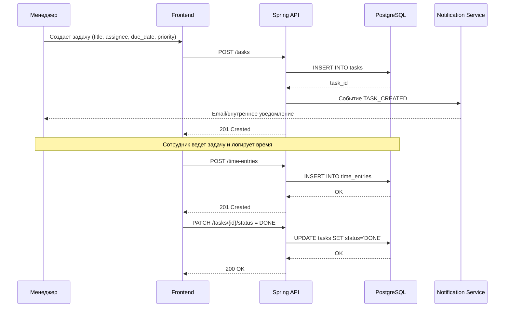
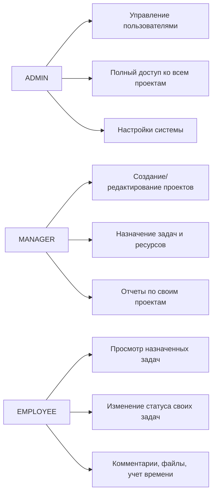

# Прототип корпоративной информационной системы управления проектами

> ВНИМАНИЕ: по условию задания реализация кода не требуется. Ниже представлена **архитектура на диаграммах** для веб-приложения небольшой IT-компании.

## 1) Контекст системы (C4: System Context)

```mermaid
flowchart LR
    client[Сотрудник / Менеджер / Администратор] --> web[Web UI\n(React + Bootstrap)]
    web --> api[Project Management API\n(Java Spring Boot)]
    api --> db[(PostgreSQL)]

    api --> mail[Email/SMTP сервис\n(уведомления о дедлайнах)]
    api --> cal[Google Calendar API\n(опциональная интеграция)]
    api --> storage[File Storage\n(S3/MinIO/Local)]

    manager[Руководитель] --> web
```

## 2) Контейнерная архитектура (C4: Container)

```mermaid
flowchart TB
    subgraph Browser[Браузер]
      ui[SPA Frontend\nReact + Bootstrap]
    end

    subgraph Backend[Backend (Spring Boot)]
      auth[Auth & RBAC модуль]
      proj[Project модуль]
      task[Task модуль]
      time[Time Tracking модуль]
      rep[Reporting модуль]
      notif[Notification модуль]
      file[Attachment модуль]
    end

    subgraph Data[Слой данных]
      pg[(PostgreSQL)]
      redis[(Redis cache, optional)]
      fs[(Object/File Storage)]
    end

    ui -->|REST/JSON + JWT| auth
    ui -->|REST/JSON + JWT| proj
    ui -->|REST/JSON + JWT| task
    ui -->|REST/JSON + JWT| time
    ui -->|REST/JSON + JWT| rep

    auth --> pg
    proj --> pg
    task --> pg
    time --> pg
    rep --> pg
    notif --> pg

    task --> file
    file --> fs

    rep --> redis
    notif --> smtp[SMTP]
    notif --> gcal[Google Calendar API]
```

## 3) ER-диаграмма базы данных

```mermaid
erDiagram
    USERS {
        uuid id PK
        varchar email UK
        varchar password_hash
        varchar full_name
        varchar role "ADMIN|MANAGER|EMPLOYEE"
        boolean is_active
        timestamp created_at
        timestamp updated_at
    }

    PROJECTS {
        uuid id PK
        varchar name
        text description
        uuid manager_id FK
        date start_date
        date due_date
        varchar status "PLANNED|ACTIVE|ON_HOLD|DONE"
        timestamp created_at
        timestamp updated_at
    }

    PROJECT_MEMBERS {
        uuid id PK
        uuid project_id FK
        uuid user_id FK
        varchar allocation "e.g., 50%"
        timestamp joined_at
    }

    TASKS {
        uuid id PK
        uuid project_id FK
        uuid assignee_id FK
        uuid reporter_id FK
        varchar title
        text description
        varchar priority "LOW|MEDIUM|HIGH|CRITICAL"
        varchar status "TODO|IN_PROGRESS|REVIEW|DONE"
        date due_date
        int story_points
        timestamp created_at
        timestamp updated_at
    }

    TASK_COMMENTS {
        uuid id PK
        uuid task_id FK
        uuid author_id FK
        text body
        timestamp created_at
    }

    ATTACHMENTS {
        uuid id PK
        uuid task_id FK
        uuid uploaded_by FK
        varchar file_name
        varchar mime_type
        bigint file_size
        varchar storage_key
        timestamp uploaded_at
    }

    TIME_ENTRIES {
        uuid id PK
        uuid task_id FK
        uuid user_id FK
        date work_date
        numeric hours_spent
        text note
        timestamp created_at
    }

    REPORT_SNAPSHOTS {
        uuid id PK
        uuid project_id FK
        date period_from
        date period_to
        numeric completion_pct
        numeric total_hours
        int done_tasks
        int total_tasks
        timestamp generated_at
    }

    USERS ||--o{ PROJECTS : manages
    USERS ||--o{ PROJECT_MEMBERS : assigned
    PROJECTS ||--o{ PROJECT_MEMBERS : has

    PROJECTS ||--o{ TASKS : contains
    USERS ||--o{ TASKS : assigned_to
    USERS ||--o{ TASKS : created_by

    TASKS ||--o{ TASK_COMMENTS : has
    USERS ||--o{ TASK_COMMENTS : writes

    TASKS ||--o{ ATTACHMENTS : has
    USERS ||--o{ ATTACHMENTS : uploads

    TASKS ||--o{ TIME_ENTRIES : logs
    USERS ||--o{ TIME_ENTRIES : tracks

    PROJECTS ||--o{ REPORT_SNAPSHOTS : aggregates
```



## 4) Диаграмма ключевых REST API

```mermaid
flowchart LR
    FE[Frontend] --> A1[/POST /auth/register/]
    FE --> A2[/POST /auth/login/]

    FE --> P1[/GET /projects/]
    FE --> P2[/POST /projects/]
    FE --> P3[/PATCH /projects/{id}/]

    FE --> T1[/GET /projects/{id}/tasks/]
    FE --> T2[/POST /tasks/]
    FE --> T3[/PATCH /tasks/{id}/status/]

    FE --> C1[/POST /tasks/{id}/comments/]
    FE --> F1[/POST /tasks/{id}/attachments/]

    FE --> TM1[/POST /time-entries/]
    FE --> TM2[/GET /users/{id}/time-entries/]

    FE --> R1[/GET /reports/projects/{id}/summary/]
    FE --> R2[/GET /reports/projects/{id}/export?format=pdf|xlsx/]
```

## 5) Диаграмма последовательности: жизненный цикл задачи



## 6) Диаграмма ролей и прав (RBAC)



## 7) Нефункциональные аспекты (коротко)

- **Безопасность:** JWT + BCrypt, проверка ролей на endpoint-ах, audit-log изменений статусов задач.
- **Производительность:** индексы по `tasks(project_id, status, due_date)` и `time_entries(user_id, work_date)`.
- **Масштабирование:** stateless backend, горизонтальное масштабирование API; файловое хранилище вынесено отдельно.
- **Надежность:** ежедневные backup БД, health-check `/actuator/health`, централизованные логи.

## 8) План выполнения (если потребуется переход от прототипа к реализации)

1. Неделя 1: уточнение требований + согласование ER и API-контрактов.
2. Неделя 2: реализация auth, projects, tasks.
3. Неделя 3: time tracking, отчеты, уведомления.
4. Неделя 4: тестирование, документация, демо.

